# Good Boy Quiz

The Good Boy Quiz homepage was build in order to challenge visitors on their knowledge of different dog breeds. Since more and more people are interested in working with dogs, this quiz will help them learning to put a face to a few different dog breeds out there. If successful they can call themselves professional dog breed guessers! This quiz is aimed at different age groups with the goal to provide a fun online experience.

- [Deployed Good Boy Quiz Homepage](https://dietkest.github.io/good-boy/)

- [Good Boy Quiz repository on GitHub](https://github.com/DietkeSt/good-boy)

Responsive screenshots:

  

 

## User Experience

 

### User Stories

1. **First time visitor goal:** 
- As a user, I want to easily identify what the purpose of the website is to learn more about it.
- As a user, I want to be able to easily navigate through the quiz to find out my results quickly.

    - **Success criteria:** 
        - We know this to be true, if a user starts the quiz after submitting their name. 
        - We know this to be true, if a user reaches the results section of the quiz.

    - **Development:** 
        - I think adding an instruction button that explains how the website works will help the user in navigating through the quiz.
        - I think explaining the purpose of the page in a short intro text on the landing page will help the user understand its purpose right away.

2. **Returning visitor goal:** As a user, I do not want to see the same content over and over again to make sure I learn about different dog breeds.

    - **Success criteria:** We know this to be true, if a user retakes the quiz several times.

    - **Development:** I think randomizing the quiz questions will help the user in having to guess different breeds upon retaking the quiz.

3. **Frequent user goal:** 
    - As a user, I want to see more information about dog breeds.
    - As a user, I want to engage in different challenges for the quiz.

    - **Success criteria:** We know this to be true, if a user engages with additional options for the quiz, like changing the difficulty level.

    - **Development:** 
        - I think adding difficulty levels will help the user having a more challenging experience.
        - I think adding several quizzes will help the user gain more information about dog breeds.

 

### Wireframes

The website should show different sections, depending on the quiz stage the user currently is on. Features include:

- A header section with title, possible log, and a clickable Icon that shows instructions upon click.
- Landing page with a short intro of the purpose of the website and the ability to start the quiz.
- The Quiz page with the ability to answer several quiz questions.
- The Result page that shows the final score of the correctly answered quiz questions.
- A Feedback page where the user is encouraged to give feedback about their quiz experience.
- A Thank You page that appears after the feedback was submitted.
- A 404 Error page that leads the user back to the main page, in case the user lands on a non-working link.
- A footer with copyright text. 

The wireframes shows a rough idea on how these different pages/sections should look like. The design changed in the finalized version, as I decided to not display a separate Feedback page, but instead display it in a modal. This decision was made for a better user experience, as they will not have to leave the results page when leaving feedback. This makes sure the user can check on their results after submission, if they wish to do so.

#### Landing Page section

#### Quiz Page section

#### Result Page section

#### Feedback Page section

#### Thank You Page

#### 404 Page

 

### Quiz Workflow

The workflow shows the quiz logic:

 

### Design Style Guide

#### Colors

  
  
The colors were chosen to express calmness and good readability for the contrast colors of the almost black #353839 and peach color #FBCEB1. The darker peach color #D87E4E was chosen as the accent color for an inviting and intuitive design.

- Pallet chosen with the help of [coolors.co](https://coolors.co/palette/353839-fbceb1-d87e4e-a8c3bc-83a0a0).

Additionally the green and red shade were chosen as the marker whether or not the answer was correct for a better user experience. The user has a color indication on whether the question was correctly answered, in addition to a written feedback.

The color shades were based on the accent color for a calm and seemless user experience.

- Marker colors chosen with the help of [colorhexa.com](https://www.colorhexa.com/d87e4e).

#### Font

Fonts used:

[Google Fonts import URL](https://fonts.googleapis.com/css2?family=Indie+Flower&family=Open+Sans:wght@300&display=swap)

- The Indie Flower font was used for the website titles to be in line with the - used website icon.
- Whereas Open Sans was chosen for the paragraphs and lists for readability.

#### Logo & Favicon

**Favicon**: 

**Logo**: 

The logo and favicon icon were chosen to reflect the styling of the website, so that the user has a cohesive user experience. The design should be simple, and fit to the color pattern.

<a href="https://www.flaticon.com/free-icons/puppy" title="puppy icons">Puppy icons created by Rohim - Flaticon</a>

 

## Technologies Used

 

### Languages

- [HTML5](https://en.wikipedia.org/wiki/HTML5): was used to create the structure and content throughout the website.
- [CSS3](https://en.wikipedia.org/wiki/CSS): was used to style the code throughout the website.
- [Javascript](https://en.wikipedia.org/wiki/JavaScript): was used to develop interactive components of the website.

### Frameworks, Libraries & Programs

- [Balsamiq](https://balsamiq.com/wireframes/): was used for Wireframe creation.
- [Canva](https://www.canva.com/): was used for Workflow creation.
- [Codeanywhere](https://codeanywhere.com/): was used for version control and terminal used to push to GitHub.
- [GitHub](https://github.com/): is used to store the project code and deployed website.
- [Google Fonts](https://fonts.google.com/): were used to import "Lato" and "Open Sans" font into style.css file which is used throughout the website.
- [Font Awesome](https://fontawesome.com/): was used for all icons used throughout the website.
- [Google Drive](https://drive.google.com/): is used to store documentation GIFs and videos.
- [Flat Icon](https://www.flaticon.com/): is used for website logo, favicon and results reward image.
- [Snipping Tool](https://support.microsoft.com/en-us/windows/use-snipping-tool-to-capture-screenshots-00246869-1843-655f-f220-97299b865f6b): was used to create snapshots of website and videos.
- [EzGif](https://ezgif.com/): was used to convert recorded MP4s to GIF format.

 

## Features

 

### Existing Features

#### Header Navigation

- The header is full responsive.
- Displays logo and title of the website.
- Contains the instructions icon which opens up the instructions modal on click.
- Location is accessable throughout the quiz for easier accessibility and better user experience.
- There is a color changing and zoom hover effect for the instructions icon.
- The title of the instructions icon is displayed upon hovering for a seemless navigation experience.

#### Instructions Modal

- The instructions modal can be opened by clicking on the instructions icon on the landing page as well as on the quiz and results page for easy access throughout.
- It contains a list on how to play the game and even hints towards the option of enlarging images when needed.
- The user can close the modal by clicking on a closing x icon, or outside of the modal content.
- The modal can be reopened anytime throughout the quiz experience for better user experience.
- The outside of the modal content is darkened, so that the user is focused on the modal content for a calmer user experience.

#### Landing Page

- The page is the first impression for the user and includes a welcome text that explains the purpose of the website.
- The text is short and concise to not overwehelm the user.
- It includes a gallary slider effect which has the purpose to grab the user's attention when first visiting the website.
- The landing page includes a form for the user's name and a "Start Quiz" button.
- The name is required to be entered before the user can start the quiz. If no name is entered, an error appears indicating the user needs to enter a name first.
- The start quiz button displays a differend color and shadow upon hover for better accessibility.
- The content is easy to digest for the user and clear to the point which results in a better user experience.

#### Quiz Page

- The quiz page contains the quiz question, quiz image, answer options, a retake and next button, score and question counter, as well as a progress bar. In addition it features direct feedback upon option selection.
- The quiz question is displayed on top with the quiz image right underneath, so the user has a nice overview of the task.
- The image is clickable, and upon click is enlarged while the background has a dark overlay to focus the attention on the image. This option should help the user have a clearer view of the image if needed.
- Upon clicking on the image or the X icon on the top right of the image, it is closed and the user can continue answering the quiz question. As the image opens in the same tab, it provides better user experience with less clicks.
- The options for the quiz answers show a hover effect which makes for an easier option selection for the user.
- Before an option is chosen, the next button is disabled, so that the user cannot progress in the quiz before choosing an option.
- Upon click on an option the next button is enabled again, and the user gets direct feedback whether or not the option was correct. The feedback is displayed in two ways:
    - A colored background for the option. Red for the wrong answer and green for the correct answer.
    - A written Feedback of "Correct" or "Wrong" is displayed underneath the options.

- The direct feedback should give better user experience and accessibility for the user.
- The options are also disabled and greyed out after selection, so the user cannot change the answer for the same question.
- Upon click on the "Next" button the user progresses to the next question.
- When doing so, the progress bar underneath expands, the Correct Answers as well as the Question count is displayed and changes as the user progresses in the quiz.
- This is additional feedback for the user, so they have a better overview of the quiz progress and their score. This benefits the user in deciding whether or not to retake the quiz before the quiz ends.
- The Retake button is enabled all the time and can be clicked throughout the quiz. Upon click on the retake button a modal opens, asking for confirmation if the user is sure to retake the quiz.
    - This extra security enables the user to avoid a misclick and lose the quiz by accident.

- For better readability the Retake and Next buttons display an icon on top giving another visual cue on the meaning of the buttons which makes for a better user experience.

##### Quiz Details

- The quiz contains 11 questions, but is limited to 10 questions.
- The questions are randomized to make sure the user has a harder time to guess the dog breeds upon retaking the quiz.
- The feedback is given right away after selecting an answer.
- Upon click on the next button the next question is displayed.
- The score is counted throughout the quiz as well as the quiz questions.
- Once the user reaches 10 questions the "Next" button is displayed as "Results" instead.
- Upon clicking on "Results" the user is taken to the Results Page.

#### Confirmation Modal

- The confirmation modal is opened upon click on any "Retake" button throughout the quiz experience.
    - One Retake option is displayed while the quiz is in progress.
    - Another Retake option is displayed after the user lands on the quiz results page.
- The modal consist of a short text explaining that the progress of the quiz is lost, if they retake the quiz. Underneath the user will find yes and no options displayed as buttons.
- Upon clicking on "No" the confirmation modal is closed and the user is at the same page where they left off. This is good user experience, so the user is not restarting the quiz by accident.
- Upon clicking on the "Yes" button, the user confirms and is guided back to the landing page where the page reloads.
- The buttons show a hove effect which should give the user a better overview to make it easier to click the right option.
- By clicking outside the modal, the modal window is closed as well, and the user gets back to the page they left off.

##### Results Page

- The Results page contains a short congratulatory text with the results score and an results image.
- The score displays the percentage of the correctly answered questions from the quiz.
- Underneath there is another "Retake" option displayed as a button. Upon click the confirmation modal opens which gives the user the option to retake the quiz or stay on the results page.
- There is also an icon displayed with hover effects for better accessibility and understanding of its meaning.
- That icon opens another modal. A feedback modal where the user can leave feedback about the quiz.

#### Feedback Modal

- The Feedback Modal is opened when the user clicks on the ?-icon on the Results Page.
- It shows a short title and fives bones, in a similar manner as a typical star-rating system. The bone icon was chosen to fit the theme of the dog quiz page for a more cohesive user experience.
- The bones have a hover effect and upon click a feedback form is opened.
- The user can type in comments in the feedback form field and send the form upon click on the "Send" button.
- The form can be submitted without writing any comment by just choosing one to five bones to rate the quiz.
- The Send button also features a hover effect.
- Upon click on "Send" the "Thank You" section of that modal is displayed giving the user feedback that their submission has been sent.
- The feedback modal can be closed by clicking on the x in the modal, or outside of the modal content to make it easier for the user to click the modal away if needed.

#### Footer

- The footer section includes a link to the developer's GitHub repository. The footer also contains the copyright statement to give the user a quick overview of the creator of the website.
- When the user clicks on the link, it will open in a new tab for easier navigation, and feature a hover effect for better readability.

#### 404 Error Page

- The 404 Error Page is displayed when a user lands on a page or a link that does not currently exist.
- The page follows the same design principles as the Quiz Page and displays a similar header and footer. Only the Instructions icon is missing as this is not relevant for the error page.
- The page includes a short message and image confirming the 404 error.
- Underneath the text the user will find a button that leads them back to the Landing Page. The button also has a hover effect for a cohesive user experience.

 

### Feature Ideas To Implement

#### Difficulty Levels

- I think adding difficulty levels will help the user having a more challenging experience.

#### Additional Quizzes

-  I think adding several quizzes will help the user gain more information about dog breeds.

#### Further Improvements

- Make sure to do further accessibility testing with tools like the [WAVE Web Accessibility Evaluation Tool](https://wave.webaim.org/).
- Include a fully functioning form.
- 
- 

 

## Testing

 

### Accessibility Testing

**[Wave](https://wave.webaim.org/report#/https://dietkest.github.io/good-boy/)**:

No errors, but 1 Alert.

The Alert states "Missing Fieldset" for the radio buttons. However, I decided to use the radio buttons to convert them into a rating option for the user. Using fieldset would interfere with that option.

See followed guide on [YouTube](https://www.youtube.com/watch?v=rw3eZ6XodN8&ab_channel=CodingNepal).

### Functionality & Responsiveness

1. **Browser test for functionality:**
   
- [Chrome](https://www.google.com/intl/en_ie/chrome/):
    
    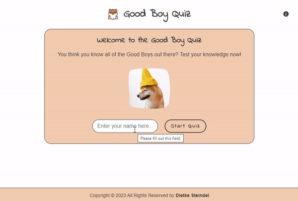
        
    Full video test [here](https://drive.google.com/file/d/1iCbe6oLoj01wLUUU6_ZcAJbl_Bo1SPTk/view?usp=sharing).
        
- [Firefox](https://www.mozilla.org/en-US/firefox/new/):
  
    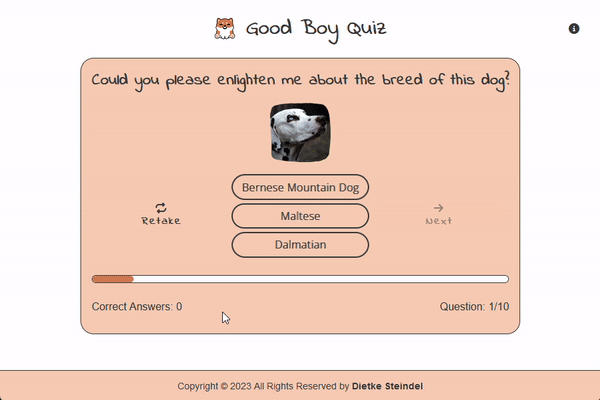

    Full video test [here](https://drive.google.com/file/d/1cwq6BHlRM9X3Uc5OltEH9fHm10cu5I13/view?usp=sharing).
        
- [Edge](https://www.microsoft.com/en-us/edge/):
  
    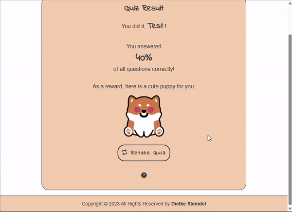

    Full video [here](https://drive.google.com/file/d/1-nl9UoTvg88eQOFyVCULEOId2qTOHw__/view?usp=sharing).

    Everything was working as expected on all three browsers tested.

2. **Responsiveness test:**

- With [Responsive Viewer](https://chrome.google.com/webstore/detail/responsive-viewer/inmopeiepgfljkpkidclfgbgbmfcennb) Chrome extension:
  
    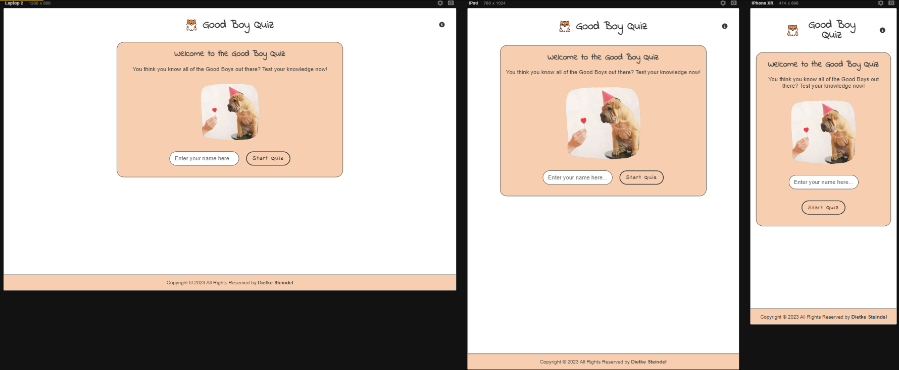
    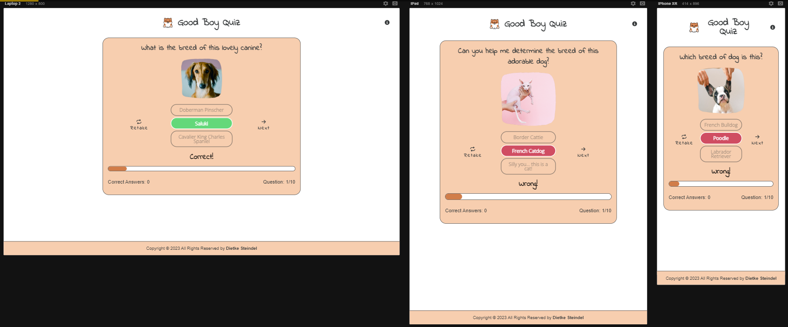
    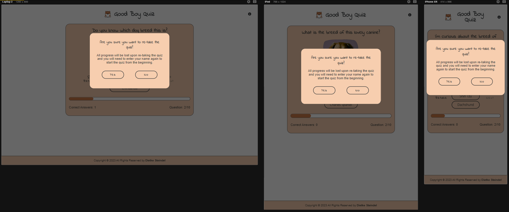
    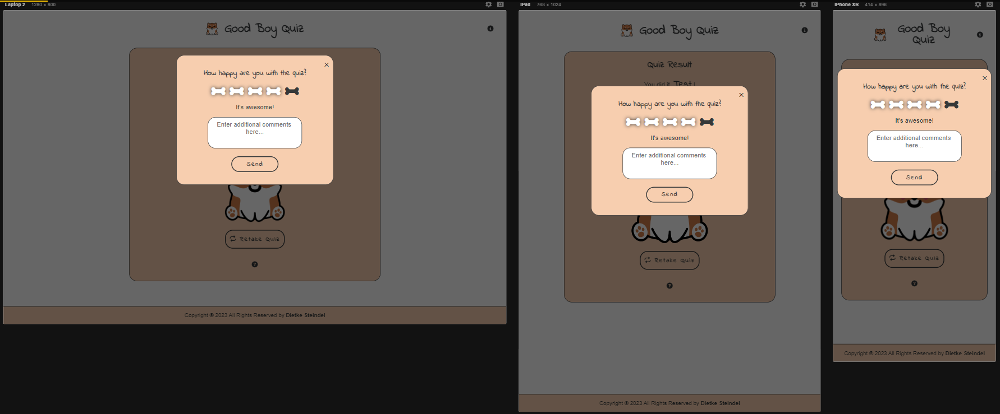
    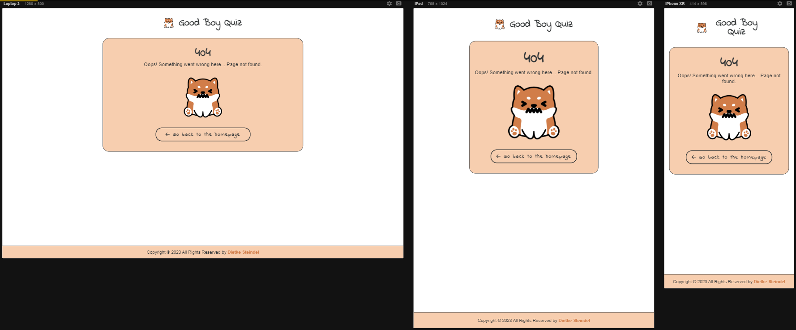
        
    Video of Responsive Viewer testing can be seen [here](https://drive.google.com/file/d/18s4XliQGXrxwz0YvLslgHCO2HPrxaVw0/view?usp=sharing)
    
- [DevTools](https://developer.chrome.com/docs/devtools/):
   
    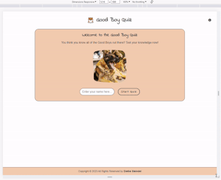
    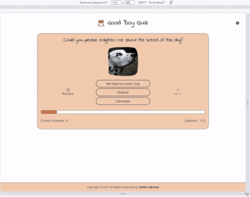
    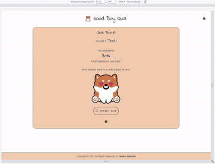
    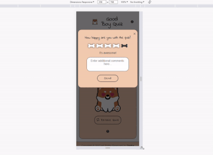
    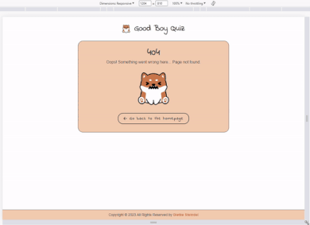

    The website was working as expected in several responsiveness testing tools.
   
3. **All links were tested as well, and are opening as expected:**
 
    #### Footer

- **Dietke Steindel**: By clicking on the name in the footer the user is redirected to https://github.com/DietkeSt/ and the window opens in a new tab.
     
    #### 404 Error Page
    
- **Go Back to Homepage**: By clicking on the back button, the user is redirected to /good-boy/.

 

### Validator Testing

#### HTML

- No errors or warnings found when passing through the official [W3C validator](https://validator.w3.org/)

    - **index.html**
    

    - **404.html**
    

    
#### CSS

- No errors were found when passing Goody Boy Quiz and 404 Page through the official [(Jigsaw) validator](https://jigsaw.w3.org/css-validator/).

#### JS

https://jshint.com/

- Shows that line 210 function is not used, however, its is used in line 171 for the displayQuestion function.

 

### Lighthouse

- Checked with [lighthouse in devtools](https://developer.chrome.com/docs/lighthouse/overview/):

    #### index.html:

  -   Desktop check was all above 90%:
     
     
  - Mobile test shows only 83% in Best Practices:
    

    - Found issues to be related to embeded video playlist and logo.
    - However, I could not verify any interference with  accessibility, or performance:
     

   #### thankyou.html:

  -   Desktop check was all above 90%:
     
     
  - Mobile check was all above 90%:
    

 

### Fixed Bugs

- The image files links for the background images would not properly load, so had to adjust links for the background images to display correctly on deployment.
- On mobile resolution, the hero text was not centered. This was caused by margin set for the container which I removed.
- On mobile, the embedded iframe did not have the correct margin set for the column display. Corrected the top margin for cohesive experience for the user.
- Footer would not display any styling, this was caused by a missing CSS closing tag for the book-call section. Adding the missing tag solved the issue.
- To enhance readability fixed the background color of the footer to a darker shade.

 

### Unfixed Bugs

- Kept Logo image in html, instead of uploading it as background image for the div. The margin would not work properly on the div.
- Margin in Book-Call section for the ul is set to 5em, as the button would otherwise overlap with the text. Did not fix this further beyond the margin setting, as it consumed a lot of time to get to the bottom of why this issue was occuring.

 

### Deployment

#### From [Codeanywhere](https://app.codeanywhere.com/)

To push the code to Github from Codeanywhere, the following command can be used "git push":

 

#### On [GitHub](https://github.com/)

1. Navigate to the GitHub repository for UX Ventures.
2. Click on the "Settings" tab and navigate to "Pages."
3. Select "Deploy from branch" for "Source."
4. Choose the "main" branch and save the changes.
5. It takes a few minutes until the deployed website is created and visible.

- Deployed website can be found here: https://dietkest.github.io/ux-ventures/ 

#### Local deployment

To make a local copy of this project in [VSCode](https://code.visualstudio.com/), these steps can be followed:

1. Navigate here <https://github.com/DietkeSt/ux-ventures.git>, and click on "Code > Local > HTTPS"
    
2. Click on "Download ZIP"

3. Navigate to the folder you want to open by using cd

4. Then, type code and the pathfile

 

## Credits

 

#### W3Schools

- Flex Direction code found here: <https://www.w3schools.com/cssref/css3_pr_flex-direction.php>

#### StackOverflow

- Box-sizing borderbox: <https://stackoverflow.com/questions/24605308/how-to-add-space-between-buttons-and-its-borders>
- Flex box: <https://stackoverflow.com/questions/48464444/how-to-display-3-items-per-row-in-flexbox>
- Current year in footer: <https://stackoverflow.com/questions/4562587/shortest-way-to-print-current-year-in-a-website>
- Open in new window, not tab: <https://stackoverflow.com/questions/12939928/make-a-link-open-a-new-window-not-tab>

#### FreeFrontend

- Hero Animation code found here: <https://freefrontend.com/css-hero-effects/>
- Blockquote styling found here: <https://freefrontend.com/css-quote-styles/>

#### Developer.Mozilla

- Z-index usage guide found here: <https://developer.mozilla.org/en-US/docs/Web/CSS/z-index>
- Width calculator guide found here: <https://developer.mozilla.org/en-US/docs/Web/CSS/calc>

#### Others

- Tested using [bootstrap button](https://getbootstrap.com/docs/5.1/components/buttons/), but removed again.  
- [SheetMonkey](https://sheetmonkey.io/) for form submission action and redirect.
- Found info on using titles in html on [W3Doc](https://www.w3docs.com/snippets/html/how-to-add-a-mouseover-text-with-html.html).
- Followed along [Kevin Powell's video](https://www.youtube.com/watch?v=8QKOaTYvYUA) to create responsive navigation bar for mobile.

 

### Content

- The code on this website was created by the developer, Dietke Steindel, unless otherwise credited.
- The text on this website is taken from [this website](https://kimsteindel.weebly.com/), and was written by Kim Steindel (used with approval).
- The icons on this website were taken from [Font Awesome](https://fontawesome.com/).
- The fonts used website were taken from [Google Fonts](https://fonts.google.com/).
- The testimonials and videos were taken from this [YouTube channel](https://www.youtube.com/@kimsteindel227) (used with approval).

 

### Media

- The [Logo](/assets/images/logo.png) was created by myself (Dietke Steindel) with the help of paint and Canva due to knowledge of the business and requirements of the logo.
- The [Book-call image of Kim Steindel](/assets/images/book-call.jpg) was used with Kim's approval.
- The [Hero image](https://www.pexels.com/de-de/foto/weisses-druckerpapier-196645/) was found on open source website Pexels.com.

 

### Acknowledgement

- Thanks to my husband, (the carrer coach) **Kim Steindel**, for providing written content for the website.
- Thanks to my mentor, **Iuliia Konovalova**, for providing great guidance and tips for this project.
- Thanks to Code Institute Slack community for feedback and help.

Credits:

Pexels:

French bulldog: https://www.pexels.com/de-de/foto/hande-hund-niedlich-hunde-4587998/
Shiba Inu: https://www.pexels.com/de-de/foto/brauner-und-weisser-hund-der-gelben-schal-tragt-4588052/
American Staffordshire: https://www.pexels.com/de-de/foto/hund-tragt-grunen-pelzmantel-2951921/
Dachshund: https://www.pexels.com/de-de/foto/nahaufnahmefoto-des-roten-dackels-895259/
Siberian Husky: https://www.pexels.com/de-de/foto/person-die-schwarzweiss-siberian-husky-halt-3671300/
Corgi: https://www.pexels.com/de-de/foto/laptop-tier-hund-niedlich-5122188/
Shar Pei: https://www.pexels.com/de-de/foto/schemel-liebe-herz-hand-4588047/
Cat: https://www.pexels.com/de-de/foto/tier-haustier-bezaubernd-tierfotografie-4588441/
Brown Saluki: https://www.pexels.com/de-de/foto/brown-saluki-1573919/
Dalmation: https://www.pexels.com/de-de/foto/nahaufnahmefoto-des-dalmatinischen-hundes-3117157/
German Shepherd: https://www.pexels.com/de-de/foto/tier-hund-haustier-gahnen-16634310/

Flaticon:

Paw icons created by Freepik: https://www.flaticon.com/free-icon/footprint-shape_58840

Code:

Favicon: https://www.w3schools.com/html/html_favicon.asp
Image slider with fade animation: https://stackoverflow.com/questions/51238836/css-image-slider-with-fade-in
Image slider with JS fading animation: https://stackoverflow.com/questions/24344805/animating-multiple-objects-simultaneously-in-angularjs-produces-choppy-animation
Sticky footer: https://materializecss.com/footer.html
Modal: https://www.youtube.com/watch?v=ywtkJkxJsdg
https://www.w3schools.com/howto/howto_css_modals.asp
Event listener: https://www.w3schools.com/js/js_htmldom_eventlistener.asp
Hide and display elements with the help of JS: https://www.geeksforgeeks.org/hide-or-show-elements-in-html-using-display-property/
Confirmation modal function: https://stackoverflow.com/questions/51863334/something-like-confirmare-u-sure-javascript
Progress bar guide: https://www.w3schools.com/howto/howto_js_progressbar.asp
How to make a quiz video guide by James Quick: https://www.youtube.com/watch?v=u98ROZjBWy8&list=PLDlWc9AfQBfZIkdVaOQXi1tizJeNJipEx&ab_channel=JamesQQuick
Transform CSS: https://developer.mozilla.org/en-US/docs/Web/CSS/transform-function/translate
Shuffle Quiz: https://stackoverflow.com/questions/2450954/how-to-randomize-shuffle-a-javascript-array
Rating section: https://www.youtube.com/watch?v=rw3eZ6XodN8&ab_channel=CodingNepal
Disable textarea reasizing: https://www.w3docs.com/snippets/css/how-to-disable-the-resizing-of-the-textarea-element.html
Set alt for JS image: https://stackoverflow.com/questions/15471688/adding-alt-attribute-to-image-in-javascript

Bug:

Upon submission the quiz would not start due to a missing result container in the HTML code, after adding it, it was working as expected again.

After adding a confirmation modal, the "No" option did not work as expected. Tried adding similar functions as for the instructions modal to close it and had to add an event listener for the "No" option, however, this did not resolve the issue.
Upon testing, found out that the issue is that two modals are being used and try to access the same closeModal function. I had to rename the function for the confirmation modal and adjust the call for the No button and that resolved the issue. The confirmation modal is now closing as expected when clicking the "no" option.

Upon adding styling for the modal buttons, the modals kept on opening on page load. The issue was that I added the wrong display type to the modal class which causes the event listeners not to work anymore. Fixing the display type to none solved the issue.

After randomizing the quiz questions, I noticed that I could guess several times for one question. To disabled that function, I added the "guessed" property to the quiz and upon option selection the other options are made inactive. This resolved the issue and makes for a more accurate quiz result in the end.

When clicking retake or retake quiz, the page would load the landing page, but not actually restart the quiz. To solve this, I added the reloaded function.

JSHInt:

212	checkAnswer
-> This is actually being used to check if the answer has been guessed and adds +1 to the score if guess correctly, so this is needed.